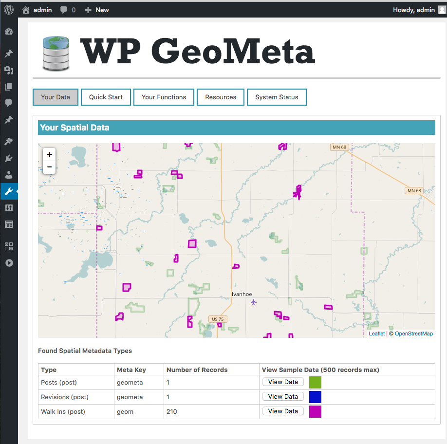
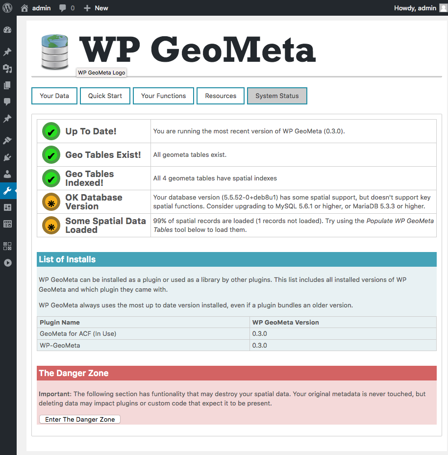

WP-GeoMeta
===========


WP-GeoMeta is a spatial foundation for WordPress. Store and search spatial metadata like
you do any other metadata, but using MySQL spatial indexes.

WP-GeoMeta lets you take advantage MySQL's spatial data types and spatial 
indexes when storing and searching spatial metadata. 


### Use WP-GeoMeta in *YOUR*  Plugin!
> WP-GeoMeta isn't just a plugin, it's also a library which other plugins can
> take advantage of. It's a spatial platform that other GIS and mapping plugins can build on. 
> If you want to use WP-GeoMeta in your plugin, check out [wp-geometa-lib](https://github.com/cimburadotcom/wp-geometa-lib) for code and 
> instructions.


It detects when [GeoJSON](http://geojson.org/) metadata is being stored, and transparently 
stores a copy in a spatial meta table. 

WP-GeoMeta also adds support for spatial search operators. When a spatial
search operator is used, WP-GeoMeta will make sure that the spatial table
is used, taking advantage of indexes and spatial relations.
This plugin provides a dashboard where you can see your existing spatial data and spatial system status. It also includes a list of the MySQL functions your database supports and admin tools for repairing the spatial meta tables if something goes wrong. 






Usage
-----

### Writing and Reading Data
Store GeoJSON strings as metadata like you would for any other metadata. 

Add geometry to a post:

    $single_feature = '{ "type": "Feature", "geometry": {"type": "Point", "coordinates": [102.0, 0.5]}, "properties": {"prop0": "value0"} }';
    add_post_meta(15,'singlegeom',$single_feature,false);

Update the post geometry: 	

    $single_feature = '{ "type": "Feature", "geometry": {"type": "Point", "coordinates": [-93.5, 45]}, "properties": {"prop0": "value0"} }';
    update_post_meta(15,'singlegeom',$single_feature,false);

Read GeoJSON back from the post;

    $single_feature = get_post_meta(15, 'singlegeom'); 
	print $singlegeom;
	// '{ "type": "Feature", "geometry": {"type": "Point", "coordinates": [-93.5, 45]}, "properties": {"prop0": "value0"} }';

### Querying

Querying is done through the WP_Query meta_query argument. See
[WP Spatial Capabilities Check](https://wordpress.org/plugins/wp-spatial-capabilities-check/) 
to generate a list of supported spatial functions for your system. 

There are three styles of queries supported, to cover three different classes of spatial functions

1. Query comparing geometries

This style of query is for all spatial functions which accept two geometries as arguments and which 
return a boolean as a result. For example ST_INTERSECTS, CONTAINS or MBROverlaps. 

The meta_query _compare_ is the function to use, and the _value_ should be a GeoJSON representation
of the geometry to use for the second argument. The geometry meta field indicated by the _key_ parameter
will be used as the first argument to the _compare_ function.

    $q = new WP_Query( array(
    	'meta_query' => array(
    		array(
    			'key' => 'singlegeom',
    			'compare' => 'ST_INTERSECTS',
    			'value' => '{"type":"Feature","geometry":{"type":"Point","coordinates":[-93.5,45]}}',
    		)
    	)
    ));
    
    while($q->have_posts() ) {
    	$q->the_post();
    	print "\t* " . get_the_title() . "\n";
    }

2. Query geometry properties

This style of query is for all spatial functions which accept a single geometry as an argument and
which return a boolean as a result. For example ST_IsSimple, IsClosed or ST_IsEmpty.

The _compare_ argument should be the function just like above, but no value is needed.

    $q = new WP_Query(array( 
    	'meta_query' => array( 
    		array( 
    		'key' => 'wpgeometa_test',
    		'compare' => 'ST_IsEmpty'
    		)
    	)));

3. Compare the results of geometry functions

This style of query is for spatial functions which accept a single geometry as an argument but return
a non-boolean response. For example, GLength, ST_Area or ST_SRID.

In these queries you may want to use a normal meta_query comparison (=, >, BETWEEN, etc.) but against
the result of a spatial function. To accomodate this type of case, you will need to add an additional
parameter _geom_op_. 

The _key_, _compare_ and _value_ are used in the regular WP_Query way, but the comparison will be 
made against the result of applying the geometry function to the spatial metadata specified.

    $q = new WP_Query(array(
    	'meta_query' => array(
    		array( 
    		'key' => 'wpgeometa_test',
    		'compare' => '>',
    		'value' => '100',
    		'geom_op' => 'NumPoints'
    	)
    	))); 

### ORDER BY

orderby with named meta clauses should work. It's a new feature though, so send me bug reports.

1) Single arg orderby (eg. Dimension, GLength, ST_Area)

    $wpq = new WP_Query(array(
    	'post_type' => 'geo_test',
    	'orderby' => ARRAY( 'dimensions' => 'ASC',  'titlemeta' => 'ASC' ),
    	'meta_query' => array(
    		'dimensions' => array( 
    			'key' => 'wpgeometa_test',
    			'geom_op' => 'Dimension'
    		)
		)));

2) Two argument function that returns a value, eg. ST_Distance. Note that I use 
```'type' => 'DECIMAL(10,7)'``` so that sorting is done numerically, instead of alphabetically.

    $wpq = new WP_Query(array(
    	'post_type' => 'geo_test',
    	'orderby' => 'distance',
    	'order' => 'ASC',
    	'meta_query' => array(
    		'distance' => array( 
    			'key' => 'wpgeometa_test',
    			'compare' => 'ST_Distance',
    			'value' => '{"type":"Feature","geometry":{"type":"Polygon","coordinates":[[[-1.26,1.08],[-1.26,1.09],[-1.21,1.09],[-1.21,1.08],[-1.26,1.08]]]}}',
    			'type' => 'DECIMAL(10,7)'
    		)
    	))); 


Server Requirements
-------------------

### WordPress
This plugin supports storing spatial metadata for posts, users, comments and
terms. 

Setting, getting and querying values should work in 4.1 with some missing functionality. 
Running orderby doesn't work until 4.2
Searching term metadata arrived in WordPress 4.4, but other
functionality should still work in older versions of WordPress.

MySQL 5.6.1 or higher is strongly recommended. Lower than MySQL 5.1.72 is untested.

WP_GeoMeta will probably work on MySQL 5.4, but spatial support was pretty weak 
before version 5.6.1. 

Before MySQL 5.6.1 spatial functions worked against the mininum bounding rectangle 
instead of the actual geometry.

MySQL 5.7 brough spatial indexes to InnoDB tables. Before that only MyISAM tables
supported spatial indexes. Anything else required a full table scan. 

If you are using MySQL 5.7, good for you, and consider converting your geo tables
to InnoDB! (and let me know how it goes).

### PHP
PHP 5.2.4 and higher are supported, just like WordPress's minimum version.
Please report any PHP errors you come across and we'll fix them up.

Frequently Asked Questions
--------------------------

### What spatial comparisons are supported?

Any spatial operation that takes two geometries and returns a boolean, 
or which takes one geometry and returns a boolean or a value is
supported, if your version of MySQL supports it. 

The following function should work, if your install of MySQL supports them: 

<table>
<tr>
<td>Area</td>
<td>Contains</td>
<td>Crosses</td>
<td>Dimension</td>
</tr>
<tr>
<td>Disjoint</td>
<td>Equals</td>
<td>GLength</td>
<td>GeometryType</td>
</tr>
<tr>
<td>Intersects</td>
<td>IsClosed</td>
<td>IsEmpty</td>
<td>IsRing</td>
</tr>
<tr>
<td>IsSimple</td>
<td>MBRContains</td>
<td>MBRCoveredBy</td>
<td>MBRDisjoint</td>
</tr>
<tr>
<td>MBREqual</td>
<td>MBREquals</td>
<td>MBRIntersects</td>
<td>MBROverlaps</td>
</tr>
<tr>
<td>MBRTouches</td>
<td>MBRWithin</td>
<td>NumGeometries</td>
<td>NumInteriorRings</td>
</tr>
<tr>
<td>NumPoints</td>
<td>Overlaps</td>
<td>SRID</td>
<td>ST_Area</td>
</tr>
<tr>
<td>ST_Contains</td>
<td>ST_Crosses</td>
<td>ST_Difference</td>
<td>ST_Dimension</td>
</tr>
<tr>
<td>ST_Disjoint</td>
<td>ST_Distance</td>
<td>ST_Distance_Sphere</td>
<td>ST_Equals</td>
</tr>
<tr>
<td>ST_GeometryType</td>
<td>ST_Intersects</td>
<td>ST_IsClosed</td>
<td>ST_IsEmpty</td>
</tr>
<tr>
<td>ST_IsRing</td>
<td>ST_IsSimple</td>
<td>ST_IsValid</td>
<td>ST_Length</td>
</tr>
<tr>
<td>ST_NumPoints</td>
<td>ST_Overlaps</td>
<td>ST_SRID</td>
<td>ST_Touches</td>
</tr>
<tr>
<td>ST_Within</td>
<td>Touches</td>
<td>Within</td>
<td></td>
</tr>
</table>


To see what your install of MySQL supports, install 
[WP Spatial Capabilities Check](https://wordpress.org/plugins/wp-spatial-capabilities-check/). 
We recommend using MySQL 5.6.1 or higher since it included many important updates to 
spatial operators.

Quotes
-----
 * "The ACF of Geo Queries" -- Nick
 * "No matter where you go, there you are"
